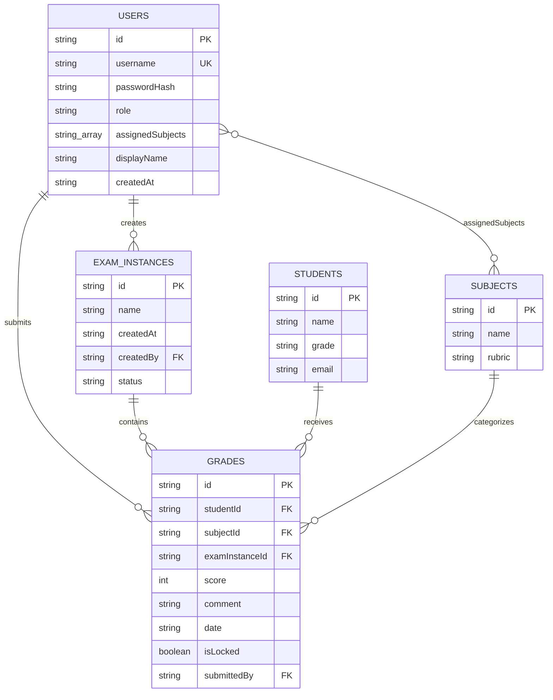
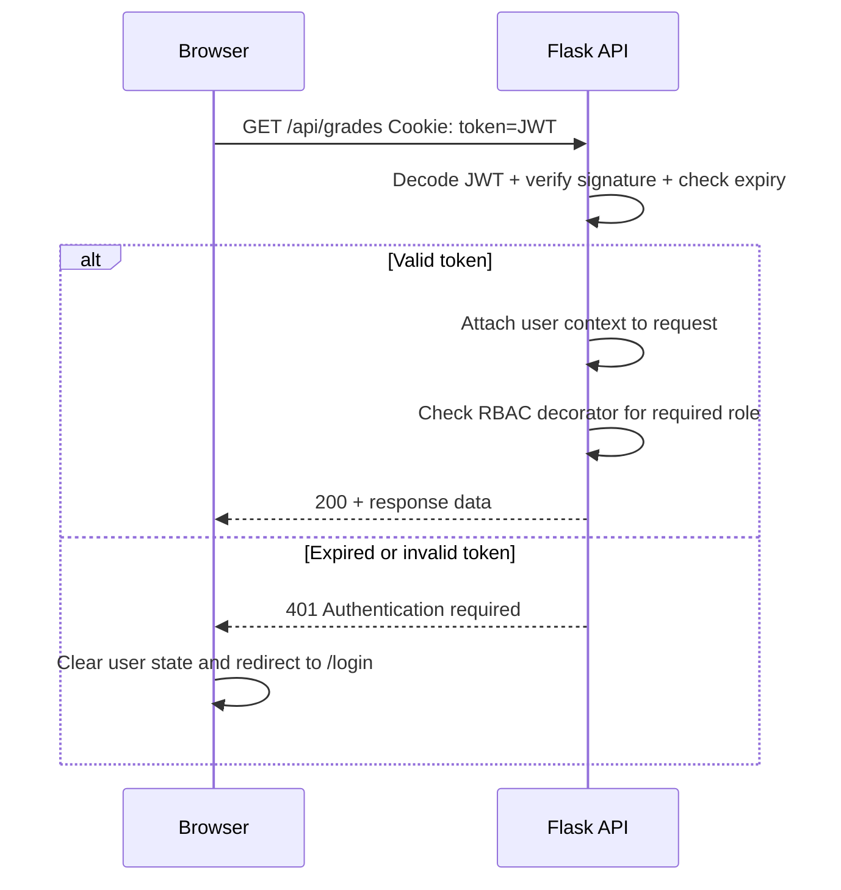
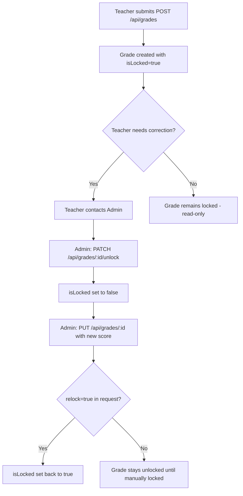
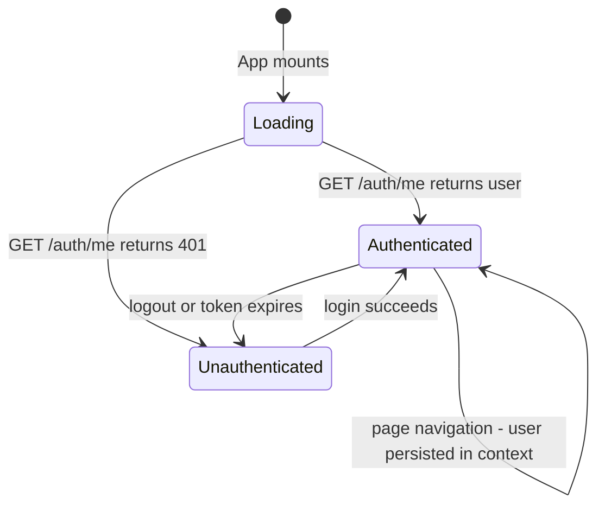

# EduManage Pro — Authentication & RBAC Architecture

> **Version:** 1.0  
> **Date:** 2026-03-08  
> **Status:** Draft — Pending Review  

---

## Table of Contents

1. [Executive Summary](#1-executive-summary)
2. [Updated Data Schema](#2-updated-data-schema)
3. [API Endpoint Design](#3-api-endpoint-design)
4. [Authentication Flow](#4-authentication-flow)
5. [RBAC Middleware Design](#5-rbac-middleware-design)
6. [Frontend Component Hierarchy & Routing](#6-frontend-component-hierarchy--routing)
7. [Frontend State Management for Auth](#7-frontend-state-management-for-auth)
8. [Migration Strategy for Existing Data](#8-migration-strategy-for-existing-data)
9. [File Locking Strategy for Concurrent Access](#9-file-locking-strategy-for-concurrent-access)
10. [Security Considerations](#10-security-considerations)

---

## 1. Executive Summary

This document defines the architecture for adding **Authentication** and **Role-Based Access Control** to EduManage Pro — a Flask + React school management application that currently has no auth layer. The system persists data in a flat JSON file (`backend/store.json`) and serves a React SPA via Vite.

### Key Architectural Decisions

| Decision | Choice | Rationale |
|---|---|---|
| Token strategy | **JWT** stored in `httpOnly` cookie | Stateless; no server-side session store needed for a JSON-file backend |
| Password hashing | **`werkzeug.security`** | Already a Flask transitive dependency — no new install needed |
| RBAC enforcement | **Python decorator** wrapping each route | Explicit, testable, no magic middleware |
| Frontend routing | **`react-router-dom` v6** | Industry standard; enables protected routes and URL-based navigation |
| File locking | **`fcntl.flock`** advisory locks | Native Linux support; sufficient for single-server JSON file access |
| CORS policy | **Explicit origin allowlist** | Replace current `CORS(app)` open policy |

### System Context Diagram


---

## 2. Updated Data Schema

### 2.1 Current Schema

The existing `store.json` contains three top-level arrays:

```jsonc
{
  "students": [{ "id", "name", "grade", "email" }],
  "subjects": [{ "id", "name", "rubric" }],
  "grades":   [{ "id", "studentId", "subjectId", "score", "comment", "date" }]
}
```

### 2.2 New Collections

Two new top-level arrays are added: `users` and `exam_instances`.

#### `users`

| Field | Type | Constraints | Description |
|---|---|---|---|
| `id` | `string` | UUID v4, PK | Unique user identifier |
| `username` | `string` | Unique, required | Login credential |
| `passwordHash` | `string` | Required | Werkzeug-generated password hash |
| `role` | `string` | Enum: `"Admin"` or `"Teacher"` | Determines access level |
| `assignedSubjects` | `string[]` | Array of subject IDs | Subjects this teacher can grade — empty for Admin |
| `displayName` | `string` | Required | Human-readable name shown in UI |
| `createdAt` | `string` | ISO 8601 date | Account creation timestamp |

```json
{
  "id": "u-a1b2c3d4",
  "username": "jsmith",
  "passwordHash": "pbkdf2:sha256:...",
  "role": "Teacher",
  "assignedSubjects": ["sub-001", "sub-003"],
  "displayName": "Mr. John Smith",
  "createdAt": "2026-03-08"
}
```

#### `exam_instances`

| Field | Type | Constraints | Description |
|---|---|---|---|
| `id` | `string` | UUID v4, PK | Unique exam identifier |
| `name` | `string` | Required | e.g. "Term 1 Final Exam, 2026" |
| `createdAt` | `string` | ISO 8601 date | When exam was created |
| `createdBy` | `string` | FK → `users.id` | Admin who created this exam |
| `status` | `string` | Enum: `"Open"` or `"Closed"` | Whether teachers can still submit grades |

```json
{
  "id": "exam-5e6f7a8b",
  "name": "Term 1 Final Exam, 2026",
  "createdAt": "2026-03-01",
  "createdBy": "u-admin-001",
  "status": "Open"
}
```

### 2.3 Updated `grades` Schema

Three new fields are added to every grade record:

| Field | Type | Default | Description |
|---|---|---|---|
| `isLocked` | `boolean` | `true` on submission | Once submitted, grade is locked |
| `examInstanceId` | `string` | Required FK → `exam_instances.id` | Links grade to a specific exam |
| `submittedBy` | `string` | FK → `users.id` | Teacher who entered this grade |

Updated grade record:

```json
{
  "id": "g-001",
  "studentId": "s-001",
  "subjectId": "sub-001",
  "examInstanceId": "exam-5e6f7a8b",
  "score": 86,
  "comment": "Very good performance",
  "date": "2024-11-15",
  "isLocked": true,
  "submittedBy": "u-teacher-001"
}
```

### 2.4 Complete Store Shape

```jsonc
{
  "users":          [],  // NEW
  "exam_instances": [],  // NEW
  "students":       [],  // unchanged
  "subjects":       [],  // unchanged
  "grades":         []   // augmented with isLocked, examInstanceId, submittedBy
}
```

### 2.5 Entity Relationship Diagram



---

## 3. API Endpoint Design

### 3.1 Endpoint Summary Table

Legend: 🔓 = Public, 🔑 = Any authenticated user, 👨‍🏫 = Teacher+, 🛡️ = Admin only

#### Authentication

| Method | Path | Auth | Description |
|---|---|---|---|
| `POST` | `/api/auth/login` | 🔓 | Authenticate and receive JWT |
| `POST` | `/api/auth/logout` | 🔑 | Clear JWT cookie |
| `GET` | `/api/auth/me` | 🔑 | Return current user profile and role |

#### Users — Admin Only

| Method | Path | Auth | Description |
|---|---|---|---|
| `GET` | `/api/users` | 🛡️ | List all users |
| `POST` | `/api/users` | 🛡️ | Create a new user |
| `PUT` | `/api/users/:id` | 🛡️ | Update user — role, subjects, reset password |
| `DELETE` | `/api/users/:id` | 🛡️ | Delete a user |

#### Exam Instances

| Method | Path | Auth | Description |
|---|---|---|---|
| `GET` | `/api/exam-instances` | 🔑 | List all exam instances |
| `POST` | `/api/exam-instances` | 🛡️ | Create a new exam instance |
| `PUT` | `/api/exam-instances/:id` | 🛡️ | Update exam — rename or change status |
| `DELETE` | `/api/exam-instances/:id` | 🛡️ | Delete exam instance and its grades |

#### Students

| Method | Path | Auth | Description |
|---|---|---|---|
| `GET` | `/api/students` | 🔑 | List all students |
| `POST` | `/api/students` | 🛡️ | Create student |
| `GET` | `/api/students/:id` | 🔑 | Get single student |
| `PUT` | `/api/students/:id` | 🛡️ | Update student |
| `DELETE` | `/api/students/:id` | 🛡️ | Delete student and associated grades |

#### Subjects

| Method | Path | Auth | Description |
|---|---|---|---|
| `GET` | `/api/subjects` | 🔑 | List all subjects |
| `POST` | `/api/subjects` | 🛡️ | Create subject |
| `DELETE` | `/api/subjects/:id` | 🛡️ | Delete subject |

#### Grades

| Method | Path | Auth | Description |
|---|---|---|---|
| `GET` | `/api/grades` | 🔑 | List grades — filters: `studentId`, `subjectId`, `examInstanceId` |
| `POST` | `/api/grades` | 👨‍🏫 | Submit a grade — auto-locks, enforces subject assignment |
| `PUT` | `/api/grades/:id` | 🛡️ | Edit a grade — only if unlocked by admin |
| `DELETE` | `/api/grades/:id` | 🛡️ | Delete a grade |
| `PATCH` | `/api/grades/:id/unlock` | 🛡️ | Unlock a locked grade for editing |
| `PATCH` | `/api/grades/:id/lock` | 🛡️ | Re-lock a grade after correction |

#### Dashboard & Reports

| Method | Path | Auth | Description |
|---|---|---|---|
| `GET` | `/api/dashboard` | 🔑 | Global dashboard stats — Admin: all data; Teacher: assigned subjects only |
| `GET` | `/api/reports/student/:id` | 🔑 | Student report card |
| `GET` | `/api/reports/subject/:id` | 🔑 | Subject performance report |
| `POST` | `/api/evaluate-score` | 🔑 | Preview rubric for a score |

### 3.2 Request/Response Shapes

#### `POST /api/auth/login`

**Request:**
```json
{
  "username": "jsmith",
  "password": "s3cureP@ss"
}
```

**Success Response (200):**
```json
{
  "user": {
    "id": "u-a1b2c3d4",
    "username": "jsmith",
    "role": "Teacher",
    "displayName": "Mr. John Smith",
    "assignedSubjects": ["sub-001", "sub-003"]
  }
}
```
*Also sets `Set-Cookie: token=<JWT>; HttpOnly; SameSite=Strict; Path=/`*

**Error Response (401):**
```json
{ "error": "Invalid username or password" }
```

#### `GET /api/auth/me`

**Response (200):** Same shape as login `user` object.  
**Response (401):** `{ "error": "Authentication required" }`

#### `POST /api/grades` — Teacher Submitting a Grade

**Request:**
```json
{
  "studentId": "s-001",
  "subjectId": "sub-001",
  "examInstanceId": "exam-5e6f7a8b",
  "score": 86,
  "date": "2026-03-08"
}
```

**Validation Rules:**
1. `subjectId` must be in the teacher's `assignedSubjects`
2. Exam instance must exist and have `status: "Open"`
3. No duplicate grade for same `studentId` + `subjectId` + `examInstanceId`
4. Score must be integer 0–100

**Success Response (201):**
```json
{
  "id": "g-newuuid",
  "studentId": "s-001",
  "subjectId": "sub-001",
  "examInstanceId": "exam-5e6f7a8b",
  "score": 86,
  "comment": "Very good performance",
  "date": "2026-03-08",
  "isLocked": true,
  "submittedBy": "u-a1b2c3d4",
  "rubric": "Exceeding Expectation 2 (EE 2)",
  "points": 7
}
```

#### `PATCH /api/grades/:id/unlock` — Admin Unlock

**Request:** *(no body required)*

**Response (200):**
```json
{
  "id": "g-001",
  "isLocked": false,
  "message": "Grade unlocked for editing"
}
```

#### `PUT /api/grades/:id` — Admin Edit After Unlock

**Request:**
```json
{
  "score": 92,
  "relock": true
}
```

**Behavior:**
- If `grade.isLocked === true`, return `403 Forbidden` with `{ "error": "Grade is locked. Unlock first." }`
- If `relock` is `true`, set `isLocked = true` after applying the edit

**Response (200):**
```json
{
  "id": "g-001",
  "score": 92,
  "comment": "Exceptional performance",
  "isLocked": true,
  "rubric": "Exceeding Expectation 1 (EE 1)",
  "points": 8
}
```

---

## 4. Authentication Flow

### 4.1 Technology Choice: JWT via `httpOnly` Cookie

**Why JWT over server-side sessions:**
- The backend uses a flat JSON file — adding a sessions table introduces further I/O overhead on every request
- JWTs are self-contained; the server only needs to verify the signature, not look up a session
- Stateless verification fits the single-file persistence model

**Why `httpOnly` cookie over `localStorage`:**
- Immune to XSS token theft — JavaScript cannot read `httpOnly` cookies
- Automatically sent with every request — no manual `Authorization` header management
- `SameSite=Strict` provides CSRF protection

### 4.2 JWT Payload

```json
{
  "sub": "u-a1b2c3d4",
  "username": "jsmith",
  "role": "Teacher",
  "iat": 1741435200,
  "exp": 1741464000
}
```

| Claim | Description |
|---|---|
| `sub` | User ID |
| `username` | Username — avoids DB lookup for display |
| `role` | `"Admin"` or `"Teacher"` — used by RBAC decorators |
| `iat` | Issued-at timestamp |
| `exp` | Expiry — 8 hours from `iat` |

### 4.3 Login Flow Sequence

```mermaid
sequenceDiagram
    participant B as Browser
    participant A as Flask API
    participant S as store.json

    B->>A: POST /api/auth/login username + password
    A->>S: read_store - find user by username
    S-->>A: user record with passwordHash
    A->>A: check_password_hash - passwordHash vs password
    alt Valid credentials
        A->>A: Generate JWT with user.id + role + 8hr expiry
        A-->>B: 200 + Set-Cookie: token=JWT; HttpOnly; SameSite=Strict
        A-->>B: JSON: user profile without passwordHash
    else Invalid credentials
        A-->>B: 401 Invalid username or password
    end
    B->>B: Store user profile in React state
    B->>B: Redirect to role-appropriate dashboard
```

### 4.4 Authenticated Request Flow



### 4.5 Logout Flow

```
POST /api/auth/logout
→ Server responds with Set-Cookie: token=; Max-Age=0; HttpOnly; SameSite=Strict
→ Frontend clears user state from React context
→ Redirect to /login
```

### 4.6 Backend Dependencies

Add to [`requirements.txt`](backend/requirements.txt):

```
PyJWT>=2.8.0
```

`werkzeug.security` (for `generate_password_hash` / `check_password_hash`) is already installed as a Flask dependency.

### 4.7 JWT Secret Management

- Store `JWT_SECRET` in an environment variable: `os.environ.get("JWT_SECRET", "dev-fallback-secret")`
- In production, generate a cryptographically random 256-bit key
- The fallback is acceptable only for local development
- Add `JWT_SECRET` to `.env` file and ensure `.env` is in `.gitignore`

---

## 5. RBAC Middleware Design

### 5.1 Decorator-Based Approach

Rather than a global middleware that parses complex route patterns, authentication and authorization are enforced via composable Python decorators applied to individual route functions. This is explicit, testable, and idiomatic Flask.

### 5.2 Decorator Definitions

```python
# auth.py — decorators module

import jwt
import os
from functools import wraps
from flask import request, jsonify, g

JWT_SECRET = os.environ.get("JWT_SECRET", "dev-fallback-secret")

def login_required(f):
    """Verify JWT and attach user to flask.g"""
    @wraps(f)
    def decorated(*args, **kwargs):
        token = request.cookies.get("token")
        if not token:
            return jsonify({"error": "Authentication required"}), 401
        try:
            payload = jwt.decode(token, JWT_SECRET, algorithms=["HS256"])
            g.current_user = {
                "id": payload["sub"],
                "username": payload["username"],
                "role": payload["role"]
            }
        except jwt.ExpiredSignatureError:
            return jsonify({"error": "Token expired"}), 401
        except jwt.InvalidTokenError:
            return jsonify({"error": "Invalid token"}), 401
        return f(*args, **kwargs)
    return decorated


def role_required(*allowed_roles):
    """Check that the authenticated user has one of the allowed roles"""
    def decorator(f):
        @wraps(f)
        @login_required
        def decorated(*args, **kwargs):
            if g.current_user["role"] not in allowed_roles:
                return jsonify({"error": "Insufficient permissions"}), 403
            return f(*args, **kwargs)
        return decorated
    return decorator


def admin_only(f):
    """Shorthand for role_required Admin"""
    return role_required("Admin")(f)


def teacher_or_admin(f):
    """Shorthand for role_required Teacher, Admin"""
    return role_required("Teacher", "Admin")(f)
```

### 5.3 Usage on Routes

```python
# Existing route — now protected
@app.route("/api/students", methods=["GET"])
@login_required
def get_students():
    ...

# Admin-only route
@app.route("/api/users", methods=["POST"])
@admin_only
def create_user():
    ...

# Teacher grade submission — with subject enforcement
@app.route("/api/grades", methods=["POST"])
@teacher_or_admin
def create_grade():
    user = g.current_user
    data = request.get_json()
    
    # If teacher, verify subject assignment
    if user["role"] == "Teacher":
        store = read_store()
        db_user = next(u for u in store["users"] if u["id"] == user["id"])
        if data["subjectId"] not in db_user["assignedSubjects"]:
            return jsonify({"error": "Not assigned to this subject"}), 403
    ...
```

### 5.4 RBAC Permission Matrix

| Resource | Action | Admin | Teacher |
|---|---|---|---|
| Users | CRUD | ✅ | ❌ |
| Students | Read | ✅ | ✅ |
| Students | Create/Update/Delete | ✅ | ❌ |
| Subjects | Read | ✅ | ✅ |
| Subjects | Create/Delete | ✅ | ❌ |
| Exam Instances | Read | ✅ | ✅ |
| Exam Instances | Create/Update/Delete | ✅ | ❌ |
| Grades | Read | ✅ All | ✅ Assigned subjects |
| Grades | Create — new | ✅ | ✅ Assigned subjects only |
| Grades | PUT — edit locked | ✅ After unlock | ❌ |
| Grades | Unlock/Lock | ✅ | ❌ |
| Grades | Delete | ✅ | ❌ |
| Dashboard | Global stats | ✅ | ❌ |
| Dashboard | Subject-scoped | ✅ | ✅ Own subjects |
| Reports | All | ✅ | ✅ Read-only |

### 5.5 Grade Locking Logic Flow



---

## 6. Frontend Component Hierarchy & Routing

### 6.1 Current Structure — Single Monolithic File

The existing [`App.jsx`](frontend/src/App.jsx) is a single ~1060-line file containing all components, state management, and page logic. Navigation uses `useState("dashboard")` with `page` string matching — no URL routing.

### 6.2 Proposed Component Tree

```
src/
├── main.jsx                          # ReactDOM entry, wraps <App> with <BrowserRouter>
├── App.jsx                           # AuthProvider + Router configuration
├── contexts/
│   └── AuthContext.jsx               # React Context for auth state + methods
├── hooks/
│   └── useAuth.js                    # Custom hook wrapping AuthContext
├── lib/
│   └── api.js                        # apiFetch helper with credentials: include
├── components/
│   ├── shared/
│   │   ├── Modal.jsx
│   │   ├── Button.jsx
│   │   ├── Input.jsx
│   │   ├── Select.jsx
│   │   ├── Card.jsx
│   │   ├── Toast.jsx
│   │   ├── Spinner.jsx
│   │   ├── EmptyState.jsx
│   │   ├── RubricBadge.jsx
│   │   ├── ScoreBar.jsx
│   │   └── FormField.jsx
│   ├── layout/
│   │   ├── AppShell.jsx              # Sidebar + header + content area
│   │   ├── Sidebar.jsx               # Role-filtered nav items
│   │   └── MobileNav.jsx
│   └── ProtectedRoute.jsx            # Redirects to /login if not authenticated
├── pages/
│   ├── LoginPage.jsx                 # Username/password form
│   ├── DashboardPage.jsx             # Role-aware dashboard
│   ├── students/
│   │   └── StudentsPage.jsx          # Admin: full CRUD, Teacher: read-only
│   ├── subjects/
│   │   └── SubjectsPage.jsx          # Admin: full CRUD, Teacher: read-only
│   ├── grading/
│   │   ├── GradingPage.jsx           # Common grading shell
│   │   ├── ExamRoster.jsx            # Teacher: exam-based grade entry form
│   │   └── GradeCorrection.jsx       # Admin: search + unlock + edit workflow
│   ├── exams/
│   │   └── ExamInstancesPage.jsx     # Admin: create/manage exam instances
│   ├── users/
│   │   └── UsersPage.jsx             # Admin: user CRUD
│   └── reports/
│       └── ReportsPage.jsx           # Student and subject reports
└── utils/
    └── grading.js                    # evaluateScore utility
```

### 6.3 Route Configuration

```jsx
// App.jsx — Route structure
<AuthProvider>
  <Routes>
    {/* Public */}
    <Route path="/login" element={<LoginPage />} />

    {/* Protected — any authenticated user */}
    <Route element={<ProtectedRoute />}>
      <Route element={<AppShell />}>
        <Route path="/" element={<DashboardPage />} />
        <Route path="/students" element={<StudentsPage />} />
        <Route path="/subjects" element={<SubjectsPage />} />
        <Route path="/grading" element={<GradingPage />} />
        <Route path="/reports" element={<ReportsPage />} />

        {/* Admin-only routes */}
        <Route path="/users" element={<ProtectedRoute requiredRole="Admin" />}>
          <Route index element={<UsersPage />} />
        </Route>
        <Route path="/exams" element={<ProtectedRoute requiredRole="Admin" />}>
          <Route index element={<ExamInstancesPage />} />
        </Route>
      </Route>
    </Route>

    {/* Fallback */}
    <Route path="*" element={<Navigate to="/" />} />
  </Routes>
</AuthProvider>
```

### 6.4 Role-Based Navigation Items

```javascript
const ALL_NAV_ITEMS = [
  { path: "/",         label: "Dashboard", icon: "dashboard", roles: ["Admin", "Teacher"] },
  { path: "/students", label: "Students",  icon: "students",  roles: ["Admin", "Teacher"] },
  { path: "/subjects", label: "Subjects",  icon: "book",      roles: ["Admin", "Teacher"] },
  { path: "/grading",  label: "Grading",   icon: "grades",    roles: ["Admin", "Teacher"] },
  { path: "/reports",  label: "Reports",   icon: "reports",   roles: ["Admin", "Teacher"] },
  { path: "/exams",    label: "Exams",     icon: "calendar",  roles: ["Admin"] },
  { path: "/users",    label: "Users",     icon: "users",     roles: ["Admin"] },
];

// In Sidebar.jsx:
const visibleItems = ALL_NAV_ITEMS.filter(item => item.roles.includes(user.role));
```

### 6.5 `ProtectedRoute` Component Design

```jsx
function ProtectedRoute({ requiredRole }) {
  const { user, loading } = useAuth();

  if (loading) return <Spinner />;
  if (!user) return <Navigate to="/login" replace />;
  if (requiredRole && user.role !== requiredRole) return <Navigate to="/" replace />;

  return <Outlet />;
}
```

### 6.6 Role-Based Conditional Rendering Examples

#### Teacher Grading Page
- Shows only assigned subjects in the subject dropdown
- Exam roster: list students, input scores, submit button
- After submission: inputs become `disabled`, submit button hidden, "Locked" badge shown
- No unlock/edit controls visible

#### Admin Grading Page
- Shows all subjects and all exam instances
- Additional "Grade Correction" tab with search functionality
- Correction workflow: search by student/subject → find grade → unlock → edit → save + re-lock

#### Dashboard Differences
- **Admin**: Total users, all subjects, all students, global average, grade distribution
- **Teacher**: Only assigned subjects' stats, only students in those subjects, scoped averages

### 6.7 New Frontend Dependencies

Add to [`package.json`](frontend/package.json):

```json
{
  "dependencies": {
    "react-router-dom": "^6.20.0"
  }
}
```

---

## 7. Frontend State Management for Auth

### 7.1 Auth Context Design

```jsx
// contexts/AuthContext.jsx

const AuthContext = createContext(null);

function AuthProvider({ children }) {
  const [user, setUser] = useState(null);       // null = not logged in
  const [loading, setLoading] = useState(true);  // true during initial check

  // On mount: check if existing cookie is valid
  useEffect(() => {
    apiFetch("/auth/me")
      .then(data => setUser(data.user))
      .catch(() => setUser(null))
      .finally(() => setLoading(false));
  }, []);

  async function login(username, password) {
    const data = await apiFetch("/auth/login", {
      method: "POST",
      body: JSON.stringify({ username, password }),
    });
    setUser(data.user);
    return data.user;
  }

  async function logout() {
    await apiFetch("/auth/logout", { method: "POST" });
    setUser(null);
  }

  const value = { user, loading, login, logout };

  return (
    <AuthContext.Provider value={value}>
      {children}
    </AuthContext.Provider>
  );
}
```

### 7.2 Auth State Lifecycle



### 7.3 API Helper Update

The existing [`apiFetch`](frontend/src/App.jsx:27) in `App.jsx` must be updated to include credentials so cookies are sent cross-origin:

```javascript
// lib/api.js
const API_BASE = "http://localhost:18080/api";

export async function apiFetch(path, options = {}) {
  const res = await fetch(`${API_BASE}${path}`, {
    headers: { "Content-Type": "application/json" },
    credentials: "include",  // <-- sends httpOnly cookies
    ...options,
  });
  if (res.status === 401) {
    // Trigger global logout if token expired mid-session
    window.dispatchEvent(new Event("auth:expired"));
    throw new Error("Authentication required");
  }
  if (!res.ok) {
    const err = await res.json().catch(() => ({ error: "Unknown error" }));
    throw new Error(err.error || `HTTP ${res.status}`);
  }
  return res.json();
}
```

### 7.4 Global Token Expiry Handler

In `AuthProvider`, listen for the `auth:expired` custom event to auto-logout:

```javascript
useEffect(() => {
  const handler = () => { setUser(null); };
  window.addEventListener("auth:expired", handler);
  return () => window.removeEventListener("auth:expired", handler);
}, []);
```

---

## 8. Migration Strategy for Existing Data

### 8.1 Problem

The existing [`store.json`](backend/store.json) contains:
- 6 students, 5 subjects, 12 grades
- Grades lack `isLocked`, `examInstanceId`, and `submittedBy` fields
- No `users` or `exam_instances` arrays exist

### 8.2 Migration Script Design

Create a one-time migration script at `backend/migrate.py`:

```
python backend/migrate.py
```

#### Step-by-step Migration Logic

1. **Backup**: Copy `store.json` → `store.backup.json`
2. **Add `users` array** with a default admin account:
   ```json
   {
     "id": "u-admin-001",
     "username": "admin",
     "passwordHash": "<generated from 'admin123'>",
     "role": "Admin",
     "assignedSubjects": [],
     "displayName": "System Administrator",
     "createdAt": "2026-03-08"
   }
   ```
3. **Add `exam_instances` array** with a legacy exam:
   ```json
   {
     "id": "exam-legacy-001",
     "name": "Legacy Imported Grades",
     "createdAt": "2024-11-15",
     "createdBy": "u-admin-001",
     "status": "Closed"
   }
   ```
4. **Augment each existing grade** with:
   - `"isLocked": true`
   - `"examInstanceId": "exam-legacy-001"`
   - `"submittedBy": "u-admin-001"`
5. **Write** the updated store back, preserving existing data

### 8.3 Migration Validation

After migration, the script should verify:
- All grades have the three new fields
- `users` array has at least one Admin
- `exam_instances` array has at least one entry
- All `examInstanceId` values in grades reference a valid exam instance
- Print a summary: `"Migrated 12 grades, created 1 admin user, created 1 legacy exam instance"`

### 8.4 Post-Migration — Default Admin Password

The migration creates admin with password `admin123`. The architecture mandates:
- A console warning is printed: `"⚠️ Default admin password is 'admin123'. Change it immediately."`
- The Admin UI should show a "Change Password" option in user settings

---

## 9. File Locking Strategy for Concurrent Access

### 9.1 Problem

The current [`read_store()`](backend/app.py:23) and [`write_store()`](backend/app.py:28) functions have no concurrency control. Two simultaneous writes can cause data loss — the last writer overwrites the first's changes.

### 9.2 Solution: Advisory File Locking with `fcntl.flock`

Use Linux advisory locks via `fcntl.flock` to serialize access to `store.json`. This is appropriate because:
- Single-server deployment — no distributed locking needed
- Advisory locks are lightweight and well-supported on Linux
- The lock is automatically released if the process crashes

### 9.3 Implementation Design

```python
import fcntl
import json
import os

STORE_PATH = os.path.join(os.path.dirname(__file__), "store.json")
LOCK_PATH = STORE_PATH + ".lock"

class StoreTransaction:
    """Context manager providing atomic read-modify-write on store.json"""

    def __init__(self, readonly=False):
        self.readonly = readonly
        self._lock_fd = None
        self.data = None

    def __enter__(self):
        self._lock_fd = open(LOCK_PATH, "w")
        if self.readonly:
            fcntl.flock(self._lock_fd, fcntl.LOCK_SH)  # shared read lock
        else:
            fcntl.flock(self._lock_fd, fcntl.LOCK_EX)  # exclusive write lock
        with open(STORE_PATH, "r") as f:
            self.data = json.load(f)
        return self

    def __exit__(self, exc_type, exc_val, exc_tb):
        if not self.readonly and exc_type is None:
            with open(STORE_PATH, "w") as f:
                json.dump(self.data, f, indent=2)
        fcntl.flock(self._lock_fd, fcntl.LOCK_UN)
        self._lock_fd.close()
        return False
```

### 9.4 Usage Pattern

```python
# Read-only operation
@app.route("/api/students", methods=["GET"])
@login_required
def get_students():
    with StoreTransaction(readonly=True) as tx:
        return jsonify(tx.data["students"])

# Read-modify-write operation
@app.route("/api/students", methods=["POST"])
@admin_only
def create_student():
    data = request.get_json()
    with StoreTransaction() as tx:
        student = {"id": str(uuid.uuid4()), ...}
        tx.data["students"].append(student)
    # write happens automatically in __exit__
    return jsonify(student), 201
```

### 9.5 Lock Types

| Operation | Lock Type | Behavior |
|---|---|---|
| `GET` requests | `LOCK_SH` — shared | Multiple concurrent reads allowed |
| `POST/PUT/PATCH/DELETE` | `LOCK_EX` — exclusive | Blocks all other reads and writes until complete |

### 9.6 Lock File Location

The lock file `store.json.lock` is created alongside `store.json`. It should be added to `.gitignore`.

---

## 10. Security Considerations

### 10.1 CORS Configuration

**Current state:** [`CORS(app)`](backend/app.py:14) allows all origins — any website can make authenticated requests to the API.

**Fix:** Restrict to the known frontend origin.

```python
from flask_cors import CORS

CORS(app, origins=["http://localhost:3000"], supports_credentials=True)
```

| Parameter | Value | Purpose |
|---|---|---|
| `origins` | `["http://localhost:3000"]` | Only allow the Vite dev server origin |
| `supports_credentials` | `True` | Required for `credentials: "include"` — allows cookies cross-origin |

**Production note:** When deployed, update `origins` to the production frontend URL. Consider using an environment variable: `ALLOWED_ORIGINS=https://school.example.com`.

### 10.2 Password Hashing

**Choice: `werkzeug.security`** — already bundled with Flask.

```python
from werkzeug.security import generate_password_hash, check_password_hash

# Creating a user
hash = generate_password_hash("user_password", method="pbkdf2:sha256", salt_length=16)

# Verifying login
if check_password_hash(stored_hash, submitted_password):
    # valid
```

**Why not `bcrypt`?**
- bcrypt requires compiling a C extension — adds deployment complexity
- `werkzeug.security` uses PBKDF2-SHA256 with configurable iterations — cryptographically sound
- Zero additional dependencies

### 10.3 JWT Security

| Concern | Mitigation |
|---|---|
| Token theft via XSS | `httpOnly` cookie — JavaScript cannot access |
| CSRF attacks | `SameSite=Strict` cookie attribute |
| Token lifetime | 8-hour expiry — forces daily re-login |
| Secret key exposure | `JWT_SECRET` from environment variable, not hardcoded |
| Algorithm confusion | Explicitly specify `algorithms=["HS256"]` during decode |

### 10.4 Cookie Configuration

```python
response.set_cookie(
    "token",
    value=jwt_token,
    httponly=True,       # no JS access
    samesite="Strict",   # no cross-site sending
    secure=False,        # True in production with HTTPS
    max_age=28800,       # 8 hours in seconds
    path="/"             # available to all routes
)
```

**Production adjustment:** Set `secure=True` when serving over HTTPS.

### 10.5 Input Validation

All existing endpoints should be audited for:

| Check | Where | Example |
|---|---|---|
| Required fields present | All POST/PUT handlers | `if not data or not all(k in data for k in required):` |
| Type validation | Score inputs | `int(data["score"])` with try/except |
| String sanitization | Name/email fields | `.strip()` already applied |
| UUID format validation | Path parameters | Verify format before DB lookup |
| Foreign key existence | Grade creation | Verify `studentId`, `subjectId`, `examInstanceId` all exist |

### 10.6 Rate Limiting — Login Endpoint

To prevent brute-force attacks on `/api/auth/login`:

- Track failed login attempts per IP in memory using a simple dict
- After 5 failed attempts within 15 minutes, return `429 Too Many Requests`
- Reset counter on successful login

```python
# Simple in-memory rate limiter
from collections import defaultdict
import time

_login_attempts = defaultdict(list)

def check_rate_limit(ip, max_attempts=5, window=900):
    now = time.time()
    _login_attempts[ip] = [t for t in _login_attempts[ip] if now - t < window]
    if len(_login_attempts[ip]) >= max_attempts:
        return False
    return True

def record_failed_attempt(ip):
    _login_attempts[ip].append(time.time())
```

### 10.7 Security Checklist

- [ ] Replace `CORS(app)` with explicit origin allowlist
- [ ] Add `credentials: "include"` to all frontend fetch calls
- [ ] Set `httpOnly`, `SameSite=Strict` on JWT cookie
- [ ] Use environment variable for `JWT_SECRET`
- [ ] Hash all passwords with `werkzeug.security`
- [ ] Validate `JWT_SECRET` is not the dev fallback in production
- [ ] Add rate limiting to `/api/auth/login`
- [ ] Add `.env` and `store.json.lock` to `.gitignore`
- [ ] Implement `StoreTransaction` file locking for all store operations
- [ ] Audit all endpoints for input validation
- [ ] Change default admin password after first login

---

## Appendix A: Implementation Order

The recommended implementation sequence ensures each phase builds on the previous and can be tested independently:

1. **Data layer hardening** — Implement `StoreTransaction` with file locking; refactor all existing routes to use it
2. **Migration script** — Create `migrate.py` to add `users`, `exam_instances`, and augment grades
3. **Auth backend** — Add `auth.py` with decorators, `/api/auth/login`, `/api/auth/logout`, `/api/auth/me`
4. **RBAC on existing routes** — Apply decorators to all existing student, subject, grade, and report endpoints
5. **New backend routes** — User CRUD, exam instance CRUD, grade unlock/lock endpoints
6. **CORS fix** — Restrict origins and enable `supports_credentials`
7. **Frontend routing** — Add `react-router-dom`, create `AuthContext`, `ProtectedRoute`, restructure `App.jsx`
8. **Login page** — Implement `LoginPage.jsx` with form, error handling, redirect
9. **Role-based navigation** — Filter nav items by role in `Sidebar.jsx`
10. **Teacher views** — Exam roster, grade entry form, locked state rendering
11. **Admin views** — User management, exam management, grade correction workflow
12. **Dashboard scoping** — Modify dashboard API and component to respect role

---

## Appendix B: Seed Data for Development

After migration, create these additional test users:

```json
[
  {
    "id": "u-teacher-001",
    "username": "jsmith",
    "passwordHash": "<hash of 'teacher123'>",
    "role": "Teacher",
    "assignedSubjects": ["sub-001", "sub-003"],
    "displayName": "Mr. John Smith",
    "createdAt": "2026-03-08"
  },
  {
    "id": "u-teacher-002",
    "username": "mwanjiku",
    "passwordHash": "<hash of 'teacher123'>",
    "role": "Teacher",
    "assignedSubjects": ["sub-002", "sub-004", "sub-005"],
    "displayName": "Ms. Mary Wanjiku",
    "createdAt": "2026-03-08"
  }
]
```

And a test exam instance:

```json
{
  "id": "exam-term1-2026",
  "name": "Term 1 Final Exam, 2026",
  "createdAt": "2026-03-01",
  "createdBy": "u-admin-001",
  "status": "Open"
}
```
